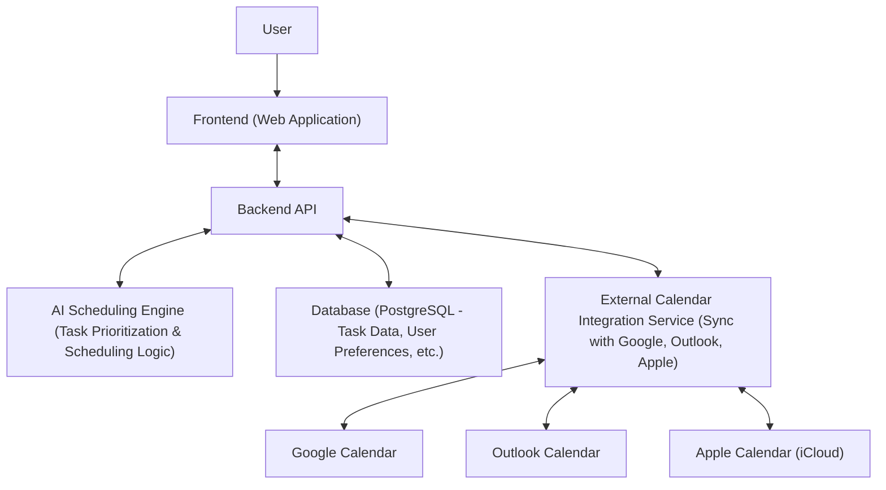

```mermaid
graph TD
    User["User"] --> Frontend["Frontend (Web Application)"];
    Frontend <--> Backend_API["Backend API"];
    Backend_API <--> AI_Scheduling_Engine["AI Scheduling Engine (Task Prioritization & Scheduling Logic)"];
    Backend_API <--> Database["Database (PostgreSQL - Task Data, User Preferences, etc.)"];
    Backend_API <--> External_Calendar_Integration_Service["External Calendar Integration Service (Sync with Google, Outlook, Apple)"];
    External_Calendar_Integration_Service <--> Google_Calendar["Google Calendar"];
    External_Calendar_Integration_Service <--> Outlook_Calendar["Outlook Calendar"];
    External_Calendar_Integration_Service <--> Apple_Calendar["Apple Calendar (iCloud)"];
```
